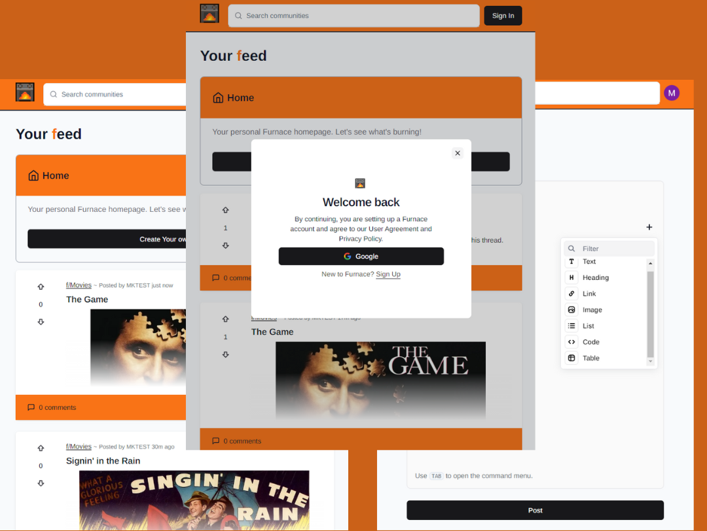

# FURNACE
___

A non-comercial project of a forum based on Reddit, where you can post all of your hot takes on every subject.
[Furnace](https://furnace-xi.vercel.app "For all your hot takes")

___

# Preview
{target="_blank"}

# Features
- Authentication using Google account.
- Infinite scrolling for dynamically loading posts.
- Highly functional post editor witch includes adding:
    - text
    - tables
    - code
    - images
    - lists
    - links
- Commenting and nesting replies.
- Voting for posts and comments.
- Custom feed.
- Changing username
- Deleting comments (only without replies)
- Search bar for threats (looking by letters included)

# Stack

- Next.js
- Typescript
- Tailwind
- Prisma
- Axios
- Zod
- Uploadthing
- NextAuth
- Shadcn

# Known Issues

Problems with parallel routing in web browser: 
> After creating a modal window with parallel routing, its necessary to create a new .next file. 

# Future Changes
- roles for moderators and admins
- improved search bar
- imporved custom feed 
- styling for text in posts
- emotes for coments
- reactions for coments
- dark mode
- rating system for users
- following users
- more options for login
- more customization for threads

# License
> [MIT](https://choosealicense.com/licenses/mit/)